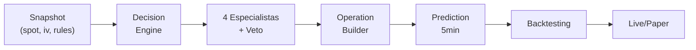

# Tito Core — Motor de Análisis Multi-Agente

## Estado: ✅ ARQUITECTURA COMPLETA

Hemos construido un sistema defensivo, multi-especialista y verificable para decisiones de trading:

```
INPUT (snapshot) 
  → Decision Engine (DecisionDetails enriquecido)
  → 4 Especialistas + Evaluador de Veto (SpecialistsAnalysis)
  → Operation Builder (salida accionable: call/put/no operar)
  → Prediction 5min (validación en tiempo real)
  → Backtesting (verificación antes de live)
```

---

## Módulos implementados

### 1. **Decision Engine** (`decisionEngine.ts`)
**Función:** `buildDecision(rules, dataQuality, snapshot) → DecisionDetails`

Toma decisiones en 5 niveles de severidad:
1. Datos bajos → revisar manualmente
2. Regla dura rota → no operar
3. Señal ambigua → revisar manualmente
4. Falta candle → esperar
5. Todo pasó → operar

**Salida:** `DecisionDetails`
- `status`: "operar" | "esperar" | "no operar" | "revisar manualmente"
- `confidence`: 0-100 (nunca corazonada)
- `razones`: factores a favor/contra
- `riskFactors`: peligros específicos
- `invalidationConditions`: qué rompe la tesis
- `stopLoss` / `takeProfit`: dinámicos (spot × factor × √IV)
- `historicalProbability`: placeholder para sub-agente 6

📖 Documentación completa: [DECISION_DETAILS.md](DECISION_DETAILS.md)

---

### 2. **Specialists Engine** (`specialistsEngine.ts`)
**Función:** `analyzeGEX/TAPE/DELTA/DevilsAdvocate() → SpecialistOpinion`

Cuatro especialistas independientes que votean en paralelo:

#### 🟢 **GEX** (Gamma Exposure)
- Analiza concentración de gamma
- Régimen (amplificador vs. revierte)
- Score: 0-100, verdict: positivo/neutral/negativo

#### 🟢 **TAPE** (Flow Analysis)
- Analiza flujo y agresividad
- Convicción y concentración
- Red flag: liquidación detectada

#### 🟢 **DELTA** (Direction)
- Analiza dirección confirmada
- Momentum y volumen
- Score ajustado por confianza

#### 🔴 **DEVIL'S ADVOCATE** (Risk Gatekeeper)
- Valida liquidez crítica
- Detecta spreads extremos
- **Tiene poder de veto** (puede bloquear todo)

**Síntesis:** `synthesizeSpecialists() → SpecialistsAnalysis`
- Promedio ponderado de scores
- Recomendación final: "call" | "put" | "no operar"
- Flag de veto si Devil's Advocate bloquea

---

### 3. **Operation Builder** (`operationBuilder.ts`)
**Función:** `buildOperation(decision, specialists, spot, dte) → Operation`

Convierte análisis complejos en **1 línea accionable**:

```
📈 CALL (78%) | Entry: $450.50 | S/L: $438.75 | T/P: $461.25 | R:R 1.05:1
```

**Campos:**
- `action`: "call" | "put" | "no operar"
- `confidence`: 0-100 (40% Decision Engine + 60% Specialists)
- `razones`: top 3 por qué
- `entryPrice`: nivel sugerido
- `stopLoss` / `takeProfit`: dinámicos
- `invalidation`: 1 línea clara (qué rompe)
- `riskRewardRatio`: T/P : S/L

**Validación automática:**
- S/L en lado correcto (debajo en CALL, arriba en PUT)
- T/P en dirección correcta
- R:R razonable (>0.5)
- Confianza >50 para operar

---

### 4. **Prediction Module 5min** (`predictionModule5min.ts`)
**Función:** `generatePrediction5min() → Prediction5min`

Predice rango a 5 minutos basado en:
- Volatilidad intradiaria
- Momentum/tendencia
- Confluencia de swings recientes

**Después de 5 min:** `validatePrediction5min() → Prediction5minResult`

Compara con real:
- ¿Tocó bajo predicho?
- ¿Tocó alto predicho?
- ¿Acertó dirección?
- `accuracyScore`: 0-100 (métrica compuesta)

**Estadísticas:** `calculatePredictionStats(results) → Prediction5minStats`
- Win rate
- Direction hit rate
- **Confidence calibration** (brecha confianza reportada vs. acierto real)
- Range error promedio

---

## Tipos de datos clave

### `DecisionDetails`
```typescript
{
  status: "operar" | "esperar" | "no operar" | "revisar manualmente",
  confidence: number, // 0-100
  razones: string[],
  riskFactors: string[],
  invalidationConditions: string[],
  stopLoss: number | null,
  takeProfit: number | null,
  historicalProbability: HistoricalProbability | null
}
```

### `SpecialistsAnalysis`
```typescript
{
  gex: SpecialistOpinion,
  tape: SpecialistOpinion,
  delta: SpecialistOpinion,
  devilsAdvocate: SpecialistOpinion,
  overallScore: number,
  recommendation: "call" | "put" | "no operar",
  vetoed: boolean,
  reasoning: string
}
```

### `Operation`
```typescript
{
  action: "call" | "put" | "no operar",
  confidence: number,
  razones: string[],
  entryPrice: number | null,
  stopLoss: number,
  takeProfit: number,
  invalidation: string,
  horizon: number,
  riskRewardRatio: number | null
}
```

---

## Testing

### Unit Tests (próximo paso)
```
decisionEngine.test.ts        ← Todas las ramas de decisión
specialistsEngine.test.ts     ← Cada especialista + síntesis
operationBuilder.test.ts      ← Validación de operaciones
predictionModule5min.test.ts  ← Predicción y accuracy
```

### Backtesting (sin live aún)
📖 Guía completa: [BACKTESTING.md](BACKTESTING.md)

**Criterios de aceptación ANTES de live:**
- ✅ Win rate ≥ 55% en 30 días históricos
- ✅ Confidence calibration gap ≥ 10pts
- ✅ 5min accuracy > 55%
- ✅ Direction hit rate > 52%
- ✅ Zero false positives en veto de Devil's Advocate

**Fases:**
1. Tests unitarios 
2. Backtesting histórico (30 días)
3. Paper mode (5 días en vivo, sin ejecutar)
4. Live con ejecución automática

---

## Arquitectura en flujo



---

## Próximos pasos

### Fase inmediata (esta sesión)
1. ✅ Arquitectura completa
2. ⏳ Tests unitarios en cada módulo
3. ⏳ Integración con workflow existente

### Fase 1 (backtesting)
4. Backtesting en datos históricos (30 días)
5. Validación de métricas (win rate, calibración)
6. Paper trading 5 días (no ejecutar)

### Fase 2 (live)
7. Ejecución automática de operaciones
8. Monitoring 24/7
9. Feedback loop (resultados → mejora especialistas)

---

## Diseño defensivo

Este sistema está diseñado para **NO OPERAR** cuando hay incertidumbre:

- ❌ Decision Engine bloquea si hay riesgo crítico
- ❌ Devil's Advocate puede vetar en cualquier momento
- ❌ Operation Builder rechaza operaciones inválidas
- ❌ Prediction Module valida cada decisión a los 5 minutos

**Filosofía:** "Más vale no operar que operar mal"

---

## Archivos

```
lib/tito-core/
├── types.ts                          # Tipos centrales (DecisionDetails, etc)
├── decisionEngine.ts                 # Motor de decisión (buildDecision)
├── specialistsEngine.ts              # 4 especialistas + síntesis
├── operationBuilder.ts               # Salida accionable
├── predictionModule5min.ts           # Predicción y validación
├── workflow.ts                       # Orquestación (usa DecisionDetails)
├── reportBuilder.ts                  # Integración con OpportunityReport
├── DECISION_DETAILS.md               # Documentación del corazón
├── BACKTESTING.md                    # Guía de testing
└── README.md                         # Este archivo
```

---

## Integración con flujo existente

El sistema actual:
```
workflow.ts
  → evaluateRules(snapshot)
  → calculateMetrics(snapshot, rules)
  → buildDecision(rules, dataQuality, snapshot) ← ✅ ENRIQUECIDO
  → buildReport(..., decision, ...)            ← ✅ USA DecisionDetails
```

**No rompe nada**, solo extiende `buildDecision()` con contexto adicional.

---

## Filosofía de diseño

1. **Puro (Pure Functions):** Mismo input = Mismo output. Fácil testear.
2. **Transparente (Observable):** Cada decisión es trazable. Razones explícitas.
3. **Defensivo (Conservative):** Bloquea antes de operar si hay duda.
4. **Validable (Verifiable):** Backtesting antes de live. Predicciones vs. real.
5. **Accionable (Actionable):** Salida simple: 1 línea que un trader puede ejecutar.

---

**Estado:** 🟢 Listo para testing  
**Próxima reunión:** Backtesting en datos históricos
